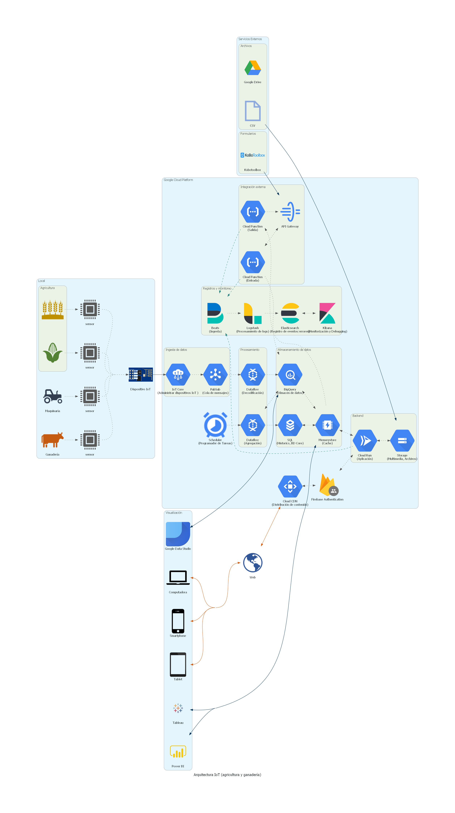

# Arquitectura IoT (Agricultura y ganadería

# Acerca de

Esta arquitectura plantea una solución para el procesamiento de datos IoT en el sector agrícola y ganadero.

Se generaliza la arquitectura de tal forma que se pueda utilizar para procesar datos de diversos sensores y su alcance se pueda extender a una gran variedad de aplicaciones.

# Diagrama

# Descripción

Como se puede observar en el diagrama, la arquitectura se divide en cuatro partes:

- **Local**: Se refiere a la parte local del sistema, donde se encuentran los sensores y actuadores. Los sensores envían datos dentro de una red local, y un dispositivo IoT se encarga de recibir los datos y transmitirlos a una red externa, en este caso a un servicio llamada IoT Core.

- **Google Cloud Platform**: Este grupo de herramientas en la nube provee una infraestructura para la creación de servicios, procesamiento, almacenamiento, consulta y visualización de datos, entre muchos otros.

- **Visualización**: En esta propuesta, se contempla visualización de datos, y monitorización. Esto permite que no solo se tome en cuenta el funcionamiento de la aplicación, sino que también se pueda extraer información relevante para la toma de decisiones.

- **Servicios Externos**: Hace referencia a servicios externos, tales como ERP (Enterprise Resource Planning), CRM (Customer Relationship Management), Kobotoolbox (Creación de formularios y herramientas para la obtención de datos), SEPAL (sistema para observación y vigilancia de la tierra), Archivos (por ejemplo, a través de Google drive), Drone Link (automatización de drones), entre otros. El sistema externo se puede integrar a través de un API a la aplicación, o bien, utilizando otro servicio según el caso específico.

Un punto importante a resaltar es que la arquitectura es modular, y, por lo tanto, no es necesario que todos los componentes que la conforman sean requeridos, se puede prescindir de algunos de ellos, o incluso se puede comenzar solo con los servicios más importantes para lograr un funcionamiento base, y luego, poco a poco, se incorporen los componentes conforme se necesiten.

## Local

En esta sección encontramos los sensores y actuadores. Podemos obtener información del ganado, los cultivos, la maquinaria, la tierra, entre muchos otros, dependiendo de la aplicación que se quiera desarrollar.

Además de los sensores, necesitamos una forma de comunicación entre la implementación local y la nube, que nos permita mandar datos a una red externa y/o internet. Para lograr esto, se contempla que en la red local exista un dispositivo que recopile los datos de los sensores, y además sea capaz de transmitirlos a la nube. Llamaremos a este artefacto "Dispositivo IoT", este puede un dispositivo pequeño como una Raspberry PI, Arduino, NodeMCU, etcétera, el único requisito es que se pueda conectar a una red y dar salida a internet, y por supuesto, que sea capaz de leer los datos de los sensores.

Una vez que tenemos todo lo necesario, solo restaría configurar el Dispositivo IoT para que se comunique con la nube, más precisamente, con el servicio IoT Core.

## GCP - Google Cloud Platform

Google Cloud Platform posee una gran variedad de servicios para todas las necesidades, por esto mismo para esta arquitectura seleccionamos aquellos que consideramos necesarios para crear una aplicación IoT.

Distribuimos la responsabilidad en distintos grupos para que sea más sencillo el mantenimiento y escalado de la aplicación.

### Ingesta de datos

- **IoT Core**: En este grupo se encuentra el IoT Core, con el cual administraremos el acceso de los dispositivos IoT a la nube. Nos permite crear conexiones seguras y transmitir datos en tiempo real.

- **Cloud Pub/Sub**: Este servicio nos permite tomar los datos de **IoT Core** y almacenarlos de forma temporal para que luego otros servicios puedan tomarlos y procesarlos.

### Procesamiento

Es importante para este tipo de aplicaciones que no solo se recolecten datos, sino que estos se procesen para generar información de valor.

- **Dataflow**: Este servicio nos permite procesar grandes volúmenes de datos y realizar transformaciones, filtrado, agrupamiento, etc.

En este grupo podemos observar dos flujos de datos, uno para la decodificación de datos, es decir, buscamos normalizar los datos para que posteriormente puedan ser almacenados con un formato más uniforme.

El segundo flujo es la agregación de datos, es decir, agrupamos los datos en periodos de tiempo que nos dé la oportunidad de procesar conjuntos de datos más granulares y no tan grandes. Este agregado también comprende otro tipo de procesamiento, por ejemplo, relacionar los datos con información de otras fuentes, ya sea de la propia aplicación, o de sistemas externos.

Por último, este grupo se compone de un Scheduler, el cual se configura para programar la agregación de datos y otras tareas que requieran ejecutarse de forma periódica.

### Almacenamiento de datos

Este grupo se encarga de la persistencia de la información, tanto de los datos masivos que generan los dispositivos IoT, como de los agregados y el core de la aplicación.

- **BigQuery**: Se trata de un almacén de datos, que nos brinda la capacidad de almacenar datos en formato de tablas y realizar consultas sobre ellos. Una particularidad de este almacén es que puede almacenar grandes volúmenes de datos y consultarlos a gran velocidad.

- **Base de datos SQL**: Un servicio para bases de datos SQL, nos permite organizar nuestra información creando relaciones entre tablas.

- **Memorystore**: Este es un servicio que permite almacenar consultas y datos en la memoria. Especialmente útil para reducir el tiempo de respuesta de la aplicación.

En la arquitectura se propone usar la base de datos SQL como una solución para almacenar la información de la aplicación y de los agregados. Mientras que los grandes volúmenes de datos provenientes de los dispositivos IoT se almacenaran en BigQuery.

Por otra parte, se colocará un Memorystore entre la base de datos y los servicios que la consumen, con el fin de que reducir los tiempos de respuesta al retener las consultas más recurrentes.

### Backend

Posiblemente se busque realizar una aplicación que permita interaccionar con usuarios, por esto mismo, se agrega un módulo de backend. La implementación de este módulo dependerá de las necesidades de la aplicación, en el diagrama propuesto se puede ver dos componentes principales:

- **Cloud Run**: Este servicio de GCP nos permite desplegar aplicaciones en contenedores, para facilitar el escalamiento según se necesite.

- **Storage:**: Con este servicio podremos almacenar archivos, tales como imágenes, videos, audios, pdf, csv, etc. Posteriormente podemos recuperar esos archivos y procesarlos, o enviarlos a otra parte de la aplicación.

En la arquitectura planteada se consideran operaciones simples de inserción, consulta, actualización y eliminación (operaciones CRUD), es por esto que tiene una estructura monolítica. Sin embargo, este módulo se puede expandir y soportar una arquitectura de backend más compleja, como por ejemplo una arquitectura por microservicios u orientada a eventos (Event Driven Architecture).

Vemos que para comunicarnos con la base de datos primero pasamos por una base de datos en memoria (cache), esto permitirá que las consultas sean más rápidas al almacenar en memoria las consultas más recurrentes de la aplicación.

Así mismo, vemos en el diagrama que para comunicar el backend de la aplicación con los dispositivos finales, utilizamos el servicio de **Firebase Authentication**, que nos ofrece una solución para la seguridad, registro y autenticación de usuarios.

Por último, antes de llegar al usuario final, pasamos por el servicio **Cloud CDN** que nos brinda una capa extra de seguridad y un balanceo de carga para soportar grandes volúmenes de tráfico.

### Integración externa

Comúnmente un sistema busca integrarse a otros sistemas para expandir su funcionalidad, es por esto que se agrega un módulo de integración externa. Este módulo permitirá tanto que las aplicaciones de terceros se integren a nuestra solución, como que nuestra solución se integre a ellas.

Se compone de dos componentes principales:

- **API Gateway**: Con este servicio podremos crear rutas que servirán como punto de acceso a los servicios externos. Brindaran una interfaz para las entradas y salidas que produzca la aplicación.

- **Cloud Function**: Nos permitirá ejecutar funciones bajo demanda, es decir, que se ejecuten cuando se requiera. Nos proporcionara la capacidad de crear múltiples funciones que se ejecuten en paralelo y que nos permitan procesar las entradas y salidas de la aplicación a los servicios externos.

En algún punto podríamos considerar remplazar las **Cloud Functions** e integrar el **API Gateway** directo a nuestro **Backend**, por ejemplo, cuando se dé el caso en que la integración con algún servicio externo sea muy recurrente, mientras ese no sea el caso, las **Cloud Functions** son ideales para reducir costos.

### Registros y monitoreo

Cuando manejamos aplicaciones distribuidas, lo cual es generalmente el caso cuando trabajamos con infraestructura en la nube, es importante tener un registro (log) de los eventos que ocurren en los distintos procesos involucrados en la aplicación, ya sea para detectar, dar seguimiento y resolución a errores, como para monitorear el rendimiento de los componentes de la aplicación y evitar posibles cuellos de botella o caída de servicios.

Para solventar esto, se propone hacer uso de **Elastic Stack**, el cual nos brinda una serie de servicios para almacenar, procesar, consultar registros y monitorear rendimientos.

El stack se compone de los siguientes servicios:

- **Beats**: Nos sirve como punto de entrada para que los componentes inserten sus registros. Posteriormente este se encargará de pasar los registros capturados al servicio de

- **Logstash**: Permite procesar los registros capturados, aplicarle filtros, transformaciones, etc. Posteriormente se encargará de almacenarlos en **Elasticsearch**.

- **Elasticsearch:** Almacena los registros en índices y además funciona como un motor de búsqueda para encontrar fácilmente los registros en base a consultas.

- **Kibana:** Nos proporciona una interfaz gráfica (UI) para visualizar los registros, realizar consultas y crear dashboards interactivos para una mejor gestión.

## Visualización

En este apartado se utiliza **Google Data Studio** para crear diagramas y gráficos en base a los datos que anteriormente hemos procesado en nuestra aplicación IoT. En esta arquitectura, se encuentra conectado a **BigQuery** para poder consultar grandes volúmenes de datos, aunque también se podría conectar a la base de datos SQL para obtener información más detallada.

Por otra parte, tenemos los dispositivos finales más comunes: `smartphone`, `tabletas` y `computadoras`. Estos se conectan a la aplicación web para poder interactuar con ella. También podremos ver los gráficos que hemos creado con **Google Data Studio**, **Tableau**, **Power BI**, o cualquier otra herramienta para creación de visualizaciones.

## Servicios externos

Como mencionábamos antes, los servicios externos nos permiten integrar nuestra aplicación con ellos, con el fin de expandir nuestra funcionalidad.

Para poder lograr esta integración debemos conocer la documentación del servicio que se desee integrar, así como el protocolo de comunicación. Por su puesto también conectividad con el servicio, generalmente por medio de internet.

# Costos

Los costos para mantener la arquitectura se pueden obtener utilizando la calculadora de costos de [GCP].

[gcp]: https://cloud.google.com/products/calculator
