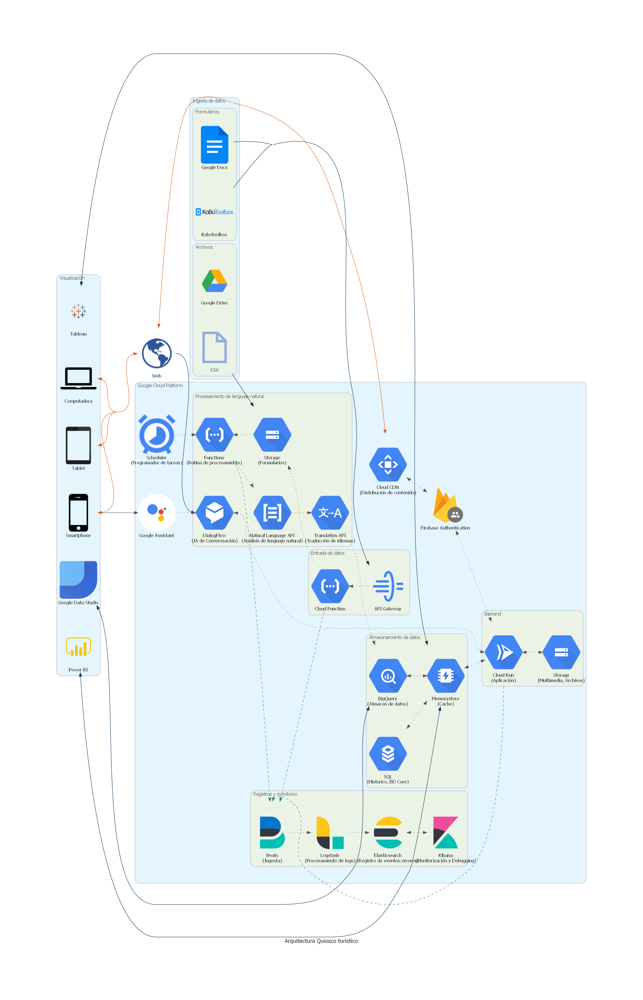

# Arquitectura Quiosco Turístico

# Acerca de

Esta arquitectura plantea una solución para el procesamiento de datos recolectados por formularios o conversaciones de chat/voz para un quiozco turístico.

La idea es que se las personas puedan interactuar con la plataforma, luego, procesar esta información con el fin de generar mejores experiencias en los centros turísticos.

# Diagrama

# Descripción

# Costos

Los costos para mantener la arquitectura se pueden obtener utilizando la calculadora de costos de [GCP].

[gcp]: https://cloud.google.com/products/calculator
