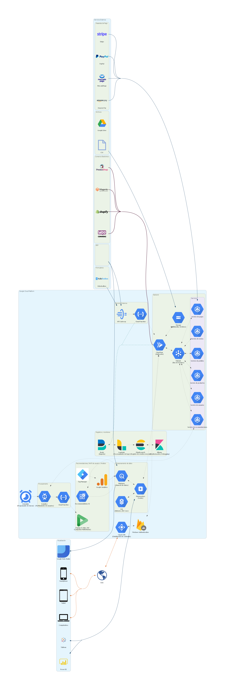

# Arquitectura E-Commerce

# Acerca de

Esta arquitectura plantea una solución para la gestión de una tienda online que sea capaz de proporcionar recomendaciones de productos a los clientes, y le permita al administrador tener un perfil de cliente con el cual poder generar campañas de marketing personalizadas.

Los clientes tendrán una mejor experiencia de compra, mientras que los administradores tendrán mayor fidelización y campañas de marketing más efectivas.

## Herramientas de Comercio Electrónico

La idea es que se pueda utilizar una plataforma de comercio electrónico que permita a los administradores gestionar los productos, categorías, promociones, clientes, etc. Adicionalmente podemos trabajar servicios de forma individual, por ejemplo, el servicio de envío, servicio de pago o servicio de recomendación de productos.

## Pasarelas de Pago

Para captar el pago de los clientes se sugiere utilizar una pasarela de pago como Stripe, Paypal, MercadoPago, Amazon Pay entre otras. Algunas herramientas de comercio electronico ya ofrecen la posibilidad de integrar pasarelas de pago, pero si no es el caso, siempre se pueden integrar al servicio de pagos.

Por seguridad no se recomienda manejar directamente los datos de pago de los clientes, ya que pondría en peligro la información financiera de los clientes. En un caso específico donde se quiera hacerlo, implicaría implementar el **Estándar de Seguridad de Datos para la Industria de Tarjeta de Pago (PCI)**. Implementar este tipo de estándares es una tarea difícil y costosa, por lo que se recomienda utilizar una pasarela de pago en su lugar.

## Recomendaciones y Análisis

Una parte fundamental del E-Commerce y de las ventas en general, es la capacidad de entender las necesidades de los clientes. Para ello la arquitectura plantea el uso un conjunto de herramientas que permiten obtener interacciones de los usuarios con **TagManager**.

Posteriormente esas interacciones se envían a **Google Analytics** con la finalidad de extraer información relevante para la gestión de la experiencia de los clientes.

Luego se almacenará la información resultante en **BigQuery** para poder ser utilizada por otros servicios como **Recommendations AI**, este servicio de recomendaciones permite mostrar productos personalizados en base a los gustos y búsquedas previas de los clientes.

## Perfil de usuario

Se propone generar un procesamiento de los datos de los clientes basado en las interacciones y recomendaciones, para generar un perfil de usuario con el cual se puedan generar campañas de marketing personalizadas.

Para esto, se propone utilizar un **Scheduler** que cada X tiempo ejecute un flujo de extracción y perfilamiento de datos de los clientes, luego esa información se envíe a un servicio como **Display & Video 360** para crear y ejecutar las campañas.

# Diagrama

# Descripción

# Costos

Los costos para mantener la arquitectura se pueden obtener utilizando la calculadora de costos de [GCP].

[gcp]: https://cloud.google.com/products/calculator
