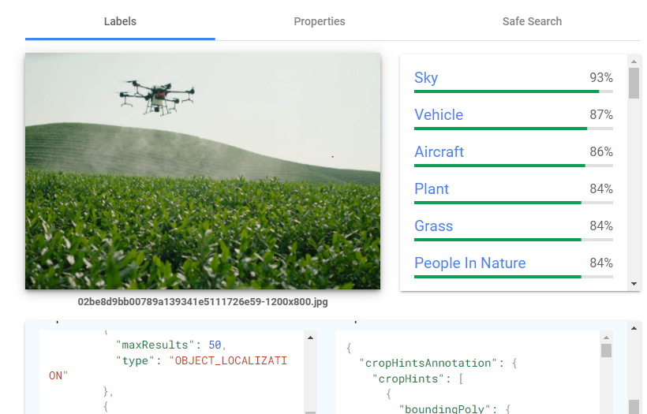
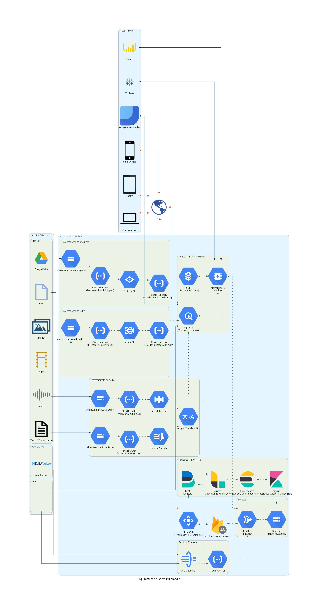

# Arquitectura de Datos Multimedia

# Acerca de

Esta arquitectura plantea una estructura de procesamiento multimedia, que permita analizar imagen, video, audio y texto.

La idea principal es poder extraer información relevante de los archivos multimedia, con el fin de utilizarlos para aplicaciones de búsqueda, filtrado de contenido, traducción automática, sistemas de recomendación, detección antispam, etc.

## Procesamiento de Imagen

Con este módulo, se recolectan imágenes en un **Storage**, esto nos permite configurar un evento que se ejecute cada vez que se suba una nueva imagen.

Cuando se ejecute el evento, lo mandara a una función que se encargara de darle un procesamiento adicional a la imagen para luego pasarla a **Vision API**.

Vision API nos entregara información de la imagen, la cual almacenaremos en BigQuery para cualquier procesamiento posterior.

## Procesamiento de Video

EL módulo de procesamiento de video por su parte, seguirá un flujo similar al de imágenes, pero con la diferencia que el procesamiento del video se realizara con **Video AI**.

Con este servicio podremos detectar objectos en el video, obtener texto que este dentro del video, detectar personas, etc. El servicio nos generara metadatos del video los cuales podremos utilizar luego para crear filtros y búsqueda en el contenido.

## Procesamiento de Texto y Audio

Aquí podemos diferenciar dos flujos, uno para procesar texto y otro para procesar audio.

Para el procesamiento de texto tenemos un **Storage** que cuando se suba un nuevo archivo, ejecutara un evento de Text to Speach, es decir, lo convertirá a voz.

Por su parte el servicio de audio hará lo opuesto, convertir de audio a texto.

Ambos flujos se conectan al servicio de traducciones, para que se pueda traducir entre idiomas y hacer aplicaciones multilenguaje.

## Interacción con Redes Sociales

Algunas redes sociales permiten integrarse a las aplicaciones, generalmente este proceso se hace a través de una API.

Podemos integrar las redes sociales para bajar contenido como video, imagen, post, comentarios, etc. Esa información la podemos procesar luego en los servicios correspondientes para crear experiencias interactivas con las personas.

# Diagrama

# Descripción

# Costos

Los costos para mantener la arquitectura se pueden obtener utilizando la calculadora de costos de [GCP].

[gcp]: https://cloud.google.com/products/calculator
