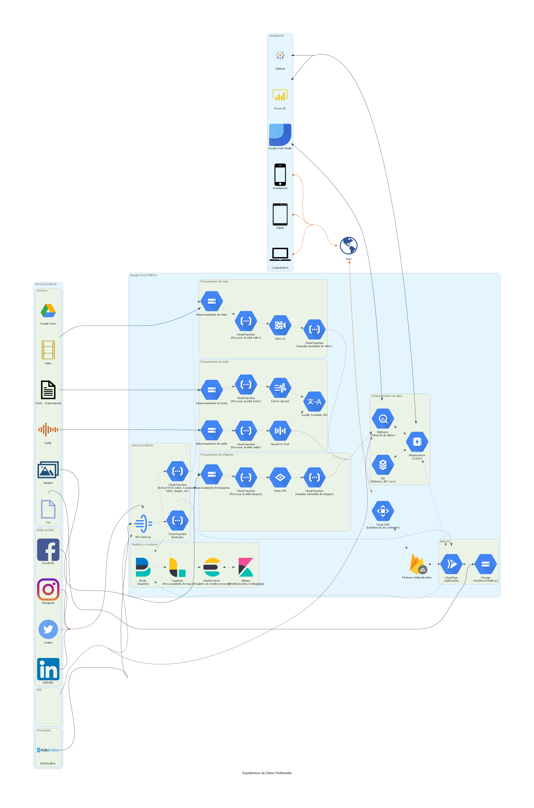

# Arquitectura de Datos Multimedia

# Acerca de

Esta arquitectura plantea una estructura de procesamiento multimedia, que permita analizar imagen, video, audio y texto.

La idea principal es poder extraer información relevante de los archivos multimedia, con el fin de utilizarlos para aplicaciones de busqueda, filtrado de contenido, traduccion automática, sistemas de recomendación, detección anti-span, etc.

# Diagrama

# Descripción

# Costos

Los costos para mantener la arquitectura se pueden obtener utilizando la calculadora de costos de [GCP].

[gcp]: https://cloud.google.com/products/calculator
