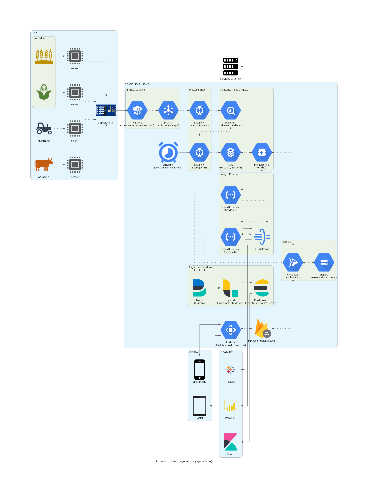

# Arquitectura IoT (Agricultura y ganadería

# Acerca de

Esta arquitectura plantea una solución para el procesamiento de datos IoT en el sector agrícola y ganadero.

Se generaliza la arquitectura de tal forma que se pueda utilizar para procesar datos de diversos sensores y su alcance se pueda extender a una gran variedad de aplicaciones.

# Diagrama

# Descripción

Como se puede observar en el diagrama, la arquitectura se divide en cuatro partes:

- **Local**: Se refiere a la parte local del sistema, donde se encuentran los sensores y actuadores. Los sensores envían datos dentro de una red local, y un dispositivo IoT se encarga de recibir los datos y transmitirlos a una red externa, en este caso a un servicio llamada IoT Core.

- **Google Cloud Platform**: Este grupo de herramientas en la nube provee una infraestructura para la creación de servicios, procesamiento, almacenamiento, consulta y visualización de datos, entre muchos otros.

- **Visualización**: En esta propuesta, se contempla visualización de datos, y monitorización. Esto permite que no solo se tome en cuenta el funcionamiento de la aplicación, sino que también se pueda extraer información relevante para la toma de decisiones.

- **Servicios Externos**: Hace referencia a servicios externos, tales como ERP (Enterprise Resource Planning), CRM (Customer Relationship Management), Kobotoolbox(Creación de formularios y herramientas para la obtención de datos), SEPAL (sistema para observación y vigilancia de la tierra), entre otros. Siempre que el sistema externo se pueda integrar a través de un API, se podrá integrar a nuestra aplicación.

Un punto importante a resaltar es que la arquitectura es modular, y por lo tanto, no es necesario que todos los componentes que la conforman sean requeridos, se puede prescindir de algunos de ellos, o incluso se puede comenzar solo con los servicios más importantes para lograr un funcionamiento base, y luego, poco a poco, se incorporen los componentes conforme se necesiten.

## Local

En esta sección encontramos los sensores y actuadores. Podemos obtener información del ganado, los cultivos, la maquinaria, la tierra, entre muchos otros, dependiendo de la aplicación que se quiera desarrollar.

Además de los sensores, necesitamos una forma de comunicación entre la implementación local y la nube, que nos permita mandar datos a una red externa y/o internet. Para lograr esto, se contempla que en la red local exista un dispositivo que recopile los datos de los sensores, y además sea capaz de transmitirlos a la nube. Llamaremos a este artefacto "Dispositivo IoT", este puede un dispositivo pequeño como una Raspberry PI, Arduino, NodeMCU, etc, el único requisito es que se pueda conectar a una red y dar salida a internet, y por supuesto, que sea capaz de leer los datos de los sensores.

Una vez que tenemos todo lo necesario, solo restaría configurar el Dispositivo IoT para que se comunique con la nube, mas precisamente, con el servicio IoT Core.

## GCP - Google Cloud Platform

Google Cloud Platform posee una gran variedad de servicios para todas las necesidades, por esto mismo para esta arquitectura selecionamos aquellos que consideramos necesarios para crear una aplicación IoT.

Distribuimos la responsabilidad en distintos grupos para que sea mas sencillo el mantenimiento y escalado de la aplicación.

### Ingesta de datos

- **Iot Core**: En este grupo se encuentra el IoT Core, con el cual administraremos el acceso de los dispositivos IoT a la nube. Nos permite crear conexiones seguras y transmitir datos en tiempo real.

- **Cloud Pub/Sub**: Este servicio nos permite tomar los datos de IoT core y almacenarlos de forma temporal para que luego otros servicios puedan tomarlos y procesarlos.

### Procesamiento

Es importante para este tipo de aplicaciones que no solo se recolecten datos, sino que estos se procesen para generar información de valor.

- **Dataflow**: Este servicios nos permite procesar grandes volúmenes de datos y realizar transformaciones, filtrado, agrupamiento, etc.

En este grupo podemos observar dos flujos de datos, uno para la decodificación de datos, es decir, buscamos normalizar los datos para que posteriormente puedan ser almacenados con un formato mas uniforme.

El segundo flujo es la agregación de datos, es decir, agrupamos los datos en periodos de tiempo que nos dé la oportunidad de procesar conjuntos de datos más granulares y no tan grandes. Este agregado también comprende otro tipo de procesamiento, por ejemplo, relacionar los datos con información de otras fuentes, ya sea de la propia aplicación, o de sistemas externos.

Por último, este grupo se compone de un Scheduler, el cual se configura para programar la agregación de datos y otras tareas que requieran ejecutarse de forma periódica.

### Almacenamiento de datos

Este grupo se encarga de la persistencia de la información, tanto de los datos masivos que generan los dispositivos IoT, como de los agregados y el core de la aplicación.

## Visualización

## Servicios externos

# Costos

Los costos para mantener la arquitectura se pueden obtener utilizando la calculadora de costos de [GCP].

[gcp]: https://cloud.google.com/products/calculator
